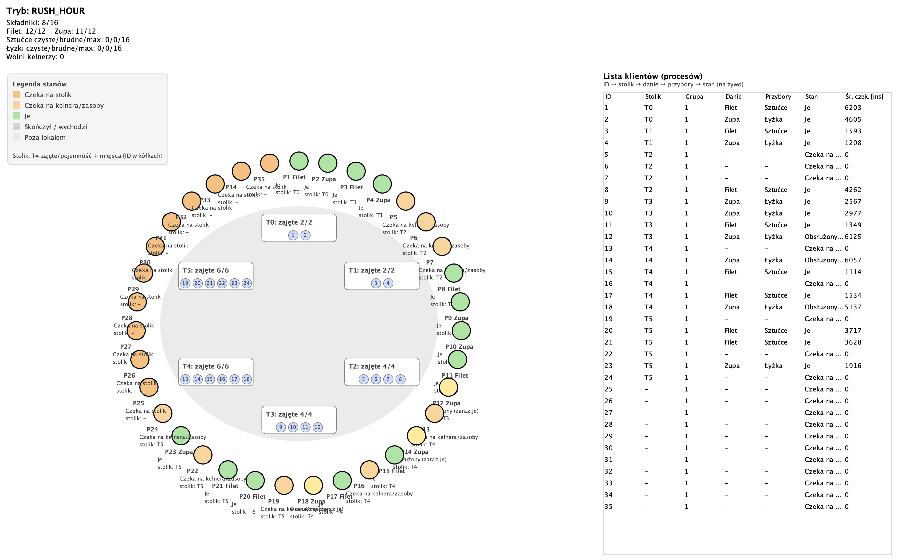
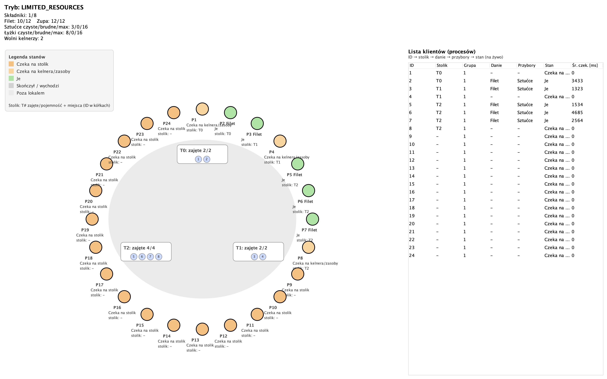
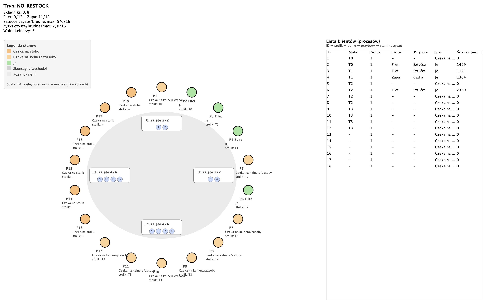
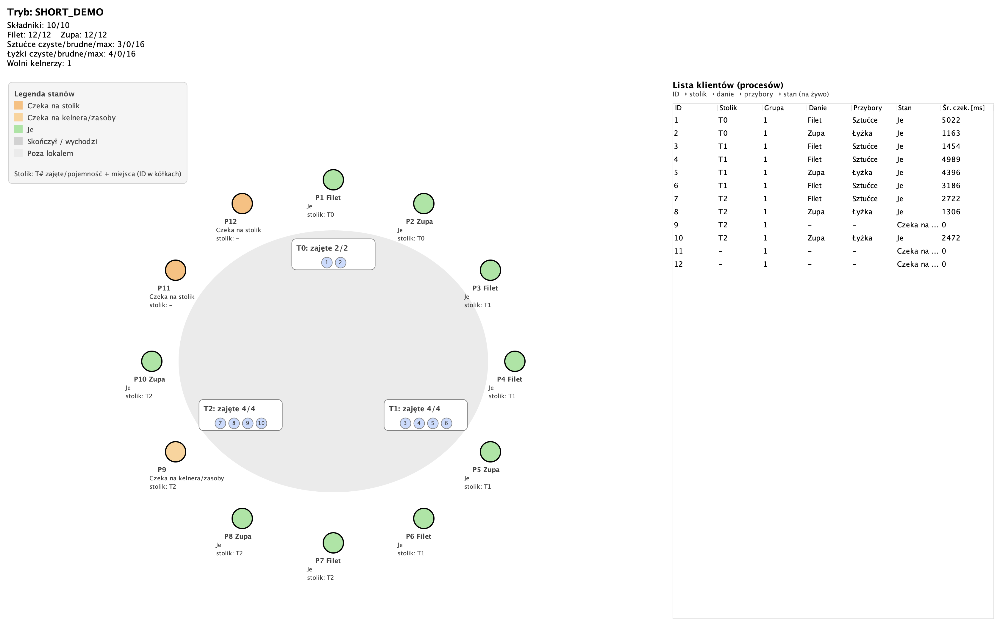
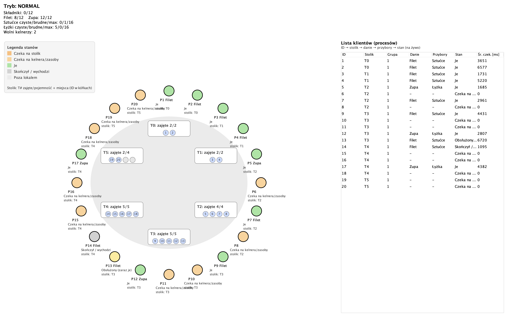
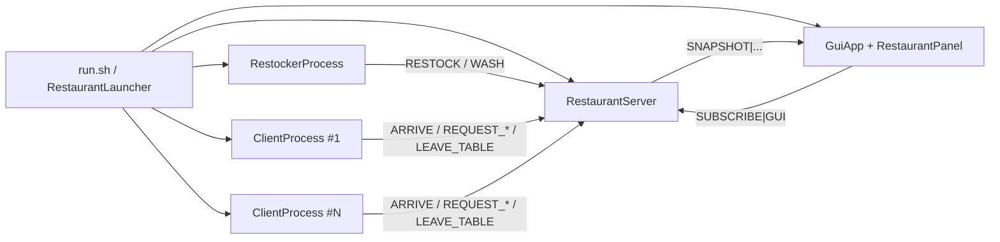

<div align="center">

# Restaurant Process Simulation

**Multi-process Java/Swing simulation of a restaurant workflow with TCP-based communication, resource allocation and live GUI visualization.**

<p>
  
  
  
  
  
</p>

<p>
  <a href="#quick-start">Run project</a> ·
  <a href="#simulation-modes">Simulation modes</a> ·
  <a href="#architecture">Architecture</a> ·
  <a href="docs/PROJECT_DOCUMENTATION_PL.md">Polish docs</a>
</p>



</div>

## About

This project simulates a restaurant as a set of independent operating-system processes. A central server owns the shared state, client processes compete for tables and service, a restocker process renews resources, and a Swing GUI displays live snapshots of the system.

The project was originally created for an Operating Systems course and then refreshed as a GitHub-ready portfolio repository.

## What It Shows

| Area | Implementation |
| --- | --- |
| Inter-process communication | Local TCP sockets and a small line-based protocol. |
| Process orchestration | Launcher starts the server, GUI, restocker and many client processes. |
| Shared resources | Tables, waiters, ingredients, meals, cutlery and spoons. |
| Resource contention | Clients wait when tables, waiters, food or utensils are unavailable. |
| Observability | GUI subscribes to server snapshots and renders current state live. |
| Scenario testing | Named modes change actual simulation parameters. |

## Tech Stack

| Layer | Tools |
| --- | --- |
| Language | Java 17+ |
| UI | Java Swing |
| Communication | TCP sockets |
| Runtime model | Multiple OS processes |
| Tooling | Bash, Makefile |

## Quick Start

```bash
chmod +x run.sh
./run.sh
```

Alternative Make target:

```bash
make run
```

The runner compiles the source files into `out/`, starts the server on a dynamic local port, opens the GUI, starts the restocker and creates client processes.

## Simulation Modes

The modes below change the real simulation parameters, not only the window label.

```bash
./run.sh --list-modes
./run.sh NORMAL
./run.sh RUSH_HOUR
./run.sh LIMITED_RESOURCES
./run.sh NO_RESTOCK
./run.sh SHORT_DEMO
```

| Mode | Best for | Behavior |
| --- | --- | --- |
| `NORMAL` | Standard presentation | Balanced number of clients, tables and resources. |
| `RUSH_HOUR` | Dynamic screenshots | More clients, larger room and faster restocking. |
| `LIMITED_RESOURCES` | Showing queues | Fewer waiters, fewer tables and slower replenishment. |
| `NO_RESTOCK` | Showing resource exhaustion | Restocker disabled, so resources gradually run out. |
| `SHORT_DEMO` | Quick finite demo | One cycle per client. |

Make shortcuts:

```bash
make run-rush
make run-limited
make run-no-restock
make run-short
```

## Screenshots

| Rush Hour | Limited Resources |
| --- | --- |
|  |  |

| No Restock | Short Demo |
| --- | --- |
|  |  |

| Normal |
| --- |
|  |

## Architecture



| Component | Responsibility |
| --- | --- |
| `RestaurantLauncher` | Starts all runtime processes from Java. |
| `RestaurantServer` | Owns the restaurant state and allocates shared resources. |
| `ClientProcess` | Simulates one client or group lifecycle. |
| `RestockerProcess` | Replenishes food resources and washes dirty utensils. |
| `GuiApp` / `RestaurantPanel` | Displays live state in a Swing dashboard. |
| `Protocol` | Provides helpers for the text socket protocol. |

## Simulated Resources

| Type | Resources | Behavior |
| --- | --- | --- |
| Fixed | Tables | Each table has capacity and can be occupied or released. |
| Movable | Waiters | Assigned temporarily, then returned to the free pool. |
| Renewable | Ingredients, meals, cutlery, spoons | Consumed by clients and renewed by the restocker process. |

## Configuration

`run.sh` accepts positional parameters. They can be used directly or after a named mode to override its defaults:

```bash
./run.sh 20 3 "2,2,4,5,5,4" 6 12 NORMAL 0 1500 1 1 1 2 2
./run.sh RUSH_HOUR 40
```

| # | Meaning | Default |
| --- | --- | --- |
| 1 | Number of client processes | `20` |
| 2 | Number of waiters | `3` |
| 3 | Table capacities | `2,2,4,5,5,4` |
| 4 | Initial ingredients | `6` |
| 5 | Maximum ingredients | `12` |
| 6 | GUI mode name | selected mode |
| 7 | Rounds per client (`0` = infinite loop) | `0` |
| 8 | Restock interval in milliseconds (`0` = disabled) | `1500` |
| 9 | Ingredients added per restock | `1` |
| 10 | Filet portions added per restock | `1` |
| 11 | Soup portions added per restock | `1` |
| 12 | Cutlery items washed per cycle | `2` |
| 13 | Spoons washed per cycle | `2` |

## Manual Build

```bash
javac -encoding UTF-8 -d out src/*.java
java -cp out RestaurantLauncher --mode RUSH_HOUR
```

## Repository Structure

```text
restaurant-process-simulation/
├── docs/
│   ├── PROJECT_DOCUMENTATION_PL.md
│   ├── SCENARIOS_PL.md
│   ├── GITHUB_PUBLISHING_PL.md
│   └── screenshots/
├── src/
│   ├── ClientProcess.java
│   ├── GuiApp.java
│   ├── Protocol.java
│   ├── RestaurantLauncher.java
│   ├── RestaurantPanel.java
│   ├── RestaurantServer.java
│   └── RestockerProcess.java
├── .editorconfig
├── .gitignore
├── Makefile
├── README.md
└── run.sh
```

## Documentation

- [Project documentation in Polish](docs/PROJECT_DOCUMENTATION_PL.md)
- [Scenario guide in Polish](docs/SCENARIOS_PL.md)
- [GitHub publishing checklist in Polish](docs/GITHUB_PUBLISHING_PL.md)

## Future Improvements

- Automated smoke tests for the protocol and resource allocation rules.
- Gradle or Maven build with GitHub Actions.
- CSV export for simulation metrics.
- Headless mode for reproducible stress tests.

## Author

**Robert Tworek**  
Technical Computer Science student focused on desktop applications, databases, TCP communication and technical documentation.
