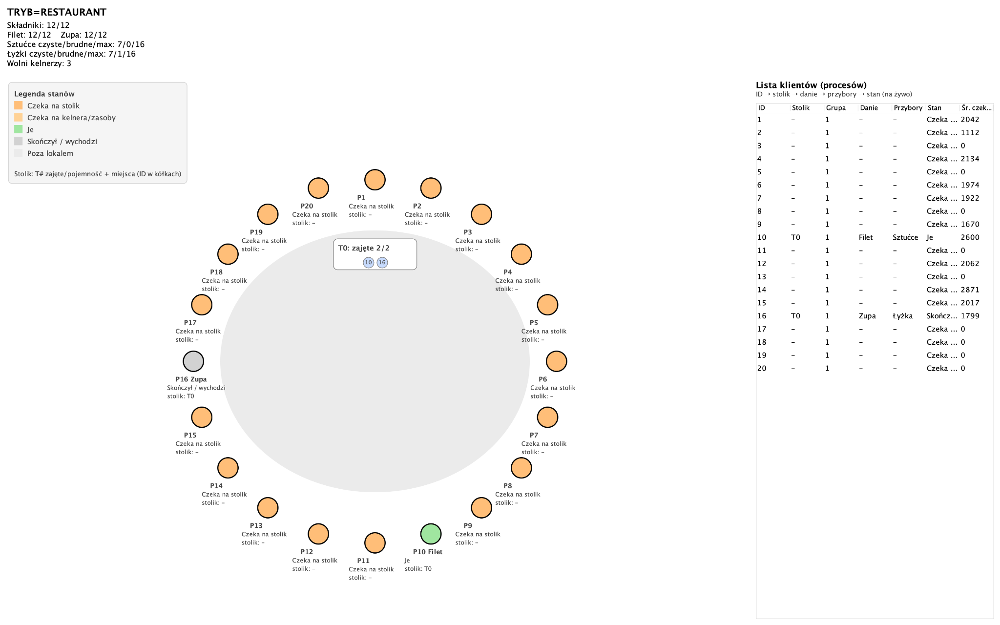
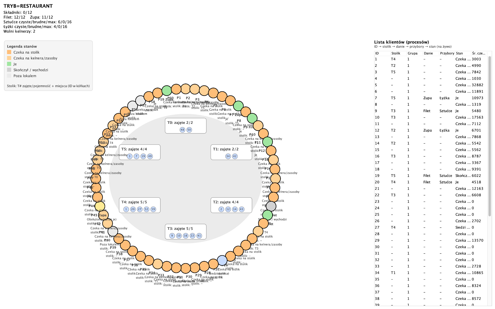

# Restaurant Process Simulation

Academic Java project prepared for an Operating Systems course. The application simulates a restaurant in which clients, the server, the GUI and the resource restocker run as separate operating-system processes and communicate through TCP sockets.

The goal of the project was to visualize competition for limited resources and observe how the system behaves under different loads.

## Features

- multi-process architecture controlled by a single launcher;
- live Swing GUI presenting tables, clients and resource availability;
- configurable number of clients, waiters and table capacities;
- fixed resources: restaurant tables;
- portable resources: waiters, cutlery and spoons;
- renewable resources: ingredients and prepared meals;
- client lifecycle: arrival, waiting for a table, requesting service, eating and leaving;
- automatic replenishment of resources by a separate restocker process.

## Architecture

| Component | Responsibility |
| --- | --- |
| `RestaurantLauncher` | Starts the server, GUI, restocker and client processes. |
| `RestaurantServer` | Stores the current restaurant state and allocates shared resources. |
| `ClientProcess` | Simulates a client moving through the restaurant lifecycle. |
| `RestockerProcess` | Replenishes ingredients and washes reusable utensils. |
| `GuiApp` and `RestaurantPanel` | Display a live visualization of the simulation. |
| `Protocol` | Provides helpers for the text-based socket protocol. |

## Screenshots

### Standard simulation



### Stress test



## Requirements

- Java Development Kit 17 or newer;
- Bash shell for the helper script on macOS or Linux.

## Run the project

```bash
chmod +x run.sh
./run.sh
```

The script compiles the Java source files, starts the server on a dynamically selected port and launches the GUI, the restocker and client processes.

Optional parameters can be passed to the script:

```bash
./run.sh 20 3 "2,2,4,5,5,4" 6 12 RESTAURANT 0
```

The values above represent: number of clients, number of waiters, table capacities, initial ingredients, maximum ingredients, GUI mode name and number of cycles per client. A cycle count of `0` keeps the simulation running until it is stopped manually.

## Project structure

```text
restaurant-process-simulation/
├── src/                    # Java source code
├── docs/screenshots/       # GUI screenshots
├── .gitignore
├── README.md
└── run.sh                  # compile and run helper script
```

## Academic context

This repository contains an educational project demonstrating process management, socket-based communication and shared-resource allocation. It was created as part of university coursework.
