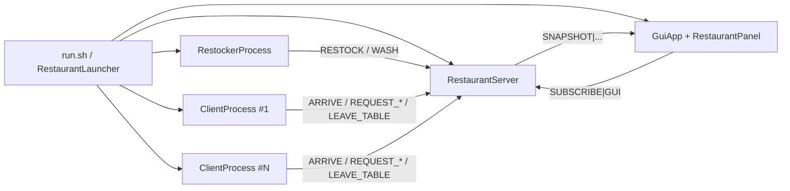

# Dokumentacja projektu: Restaurant Process Simulation

## 1. Cel projektu

Projekt symuluje działanie restauracji, w której klienci, serwer stanu, panel graficzny oraz proces odnawiania zasobów działają jako osobne procesy systemu operacyjnego. Procesy komunikują się przez lokalne gniazda TCP.

Głównym celem jest pokazanie konkurencji o ograniczone zasoby oraz obserwacja zachowania systemu przy różnym obciążeniu.

## 2. Najważniejsze funkcjonalności

- Uruchamianie wielu niezależnych procesów klientów.
- Centralny serwer zarządzający stanem restauracji.
- Wizualizacja na żywo w aplikacji Swing.
- Obsługa ograniczonych zasobów: stolików, kelnerów, składników, potraw i przyborów.
- Automatyczne uzupełnianie zasobów przez osobny proces `RestockerProcess`.
- Konfigurowalna liczba klientów, kelnerów i miejsc przy stolikach.
- Tryby działania zmieniające realne parametry symulacji.
- Możliwość uruchomienia krótkiej symulacji lub pętli działającej do ręcznego zatrzymania.

## 3. Model zasobów

| Kategoria | Zasób | Opis |
| --- | --- | --- |
| Stałe | Stoliki | Każdy stolik ma pojemność. Grupy klientów zajmują i zwalniają miejsca. |
| Przenoszone | Kelnerzy | Kelner jest przydzielany do obsługi, po czym wraca do puli wolnych kelnerów. |
| Odnawialne | Składniki | Są zużywane przy obsłudze zamówienia i uzupełniane przez restockera. |
| Odnawialne | Filet, zupa | Gotowe porcje potraw są konsumowane przez klientów i odnawiane cyklicznie. |
| Odnawialne | Sztućce, łyżki | Po jedzeniu trafiają do puli brudnych przyborów, a restocker je myje. |

## 4. Architektura



### `RestaurantServer`

Serwer jest centralnym właścicielem stanu restauracji. Przyjmuje połączenia TCP od klientów, GUI i restockera. Wątki obsługujące połączenia synchronizują dostęp do współdzielonego obiektu `State`, dzięki czemu alokacja zasobów odbywa się spójnie.

### `ClientProcess`

Każdy proces klienta reprezentuje jedną osobę lub grupę. Klient przechodzi przez cykl:

1. Wejście do restauracji.
2. Oczekiwanie na stolik.
3. Zajęcie stolika.
4. Oczekiwanie na kelnera i wymagane zasoby.
5. Jedzenie.
6. Zwrócenie brudnych przyborów.
7. Zwolnienie stolika.
8. Krótka przerwa przed kolejnym cyklem.

### `RestockerProcess`

Restocker działa niezależnie od klientów. Cyklicznie wysyła do serwera polecenia uzupełniania składników i potraw oraz mycia brudnych przyborów.

### `GuiApp` i `RestaurantPanel`

GUI subskrybuje migawki stanu z serwera. Panel pokazuje:

- liczniki zasobów,
- aktualne stoliki i zajętość miejsc,
- listę klientów/procesów,
- stan każdego klienta,
- średni czas oczekiwania na obsługę.

## 5. Protokół komunikacji

Komunikacja jest tekstowa, liniowa i oparta na separatorze `|`.

| Komenda | Nadawca | Znaczenie |
| --- | --- | --- |
| `HELLO|id|CLIENT|partySize` | Klient | Rejestruje proces klienta. |
| `SUBSCRIBE|GUI` | GUI | Subskrybuje migawki stanu. |
| `ARRIVE` | Klient | Oznacza wejście do restauracji. |
| `REQUEST_TABLE|groupSize` | Klient | Próbuje zająć stolik dla grupy. |
| `REQUEST_WAITER|meal` | Klient | Próbuje uzyskać kelnera, potrawę i przybory. |
| `START_EATING` | Klient | Zmienia stan klienta na jedzenie. |
| `DONE_EATING` | Klient | Kończy jedzenie i zwraca przybory jako brudne. |
| `LEAVE_TABLE` | Klient | Zwalnia zajęty stolik. |
| `RESTOCK|type|amount` | Restocker | Uzupełnia składniki lub potrawy. |
| `WASH|type|amount` | Restocker | Przenosi przybory z puli brudnej do czystej. |
| `SNAPSHOT|...` | Serwer | Wysyła bieżący stan do GUI. |

## 6. Konfiguracja

Najwygodniejszy sposób uruchomienia:

```bash
./run.sh
```

Przykład ze zmienionymi parametrami:

```bash
./run.sh RUSH_HOUR
./run.sh LIMITED_RESOURCES
./run.sh NO_RESTOCK
```

Tryby działania są opisane w pliku `docs/SCENARIOS_PL.md`. Parametry można nadal nadpisywać ręcznie, na przykład `./run.sh RUSH_HOUR 40` uruchamia tryb godzin szczytu z 40 klientami.

## 7. Struktura katalogów

```text
src/                    kod źródłowy Java
docs/screenshots/       zrzuty ekranu do README
docs/                   dokumentacja projektu
run.sh                  skrypt: kompilacja + uruchomienie symulacji
Makefile                skróty: make build, make run, make clean
README.md               opis repozytorium pod GitHub
```

## 8. Co projekt pokazuje rekruterowi

- Umiejętność modelowania procesu biznesowego jako systemu współbieżnego.
- Praktyczne użycie procesów systemowych i komunikacji przez sockety.
- Czytelny podział odpowiedzialności między komponentami.
- Umiejętność zbudowania prostej aplikacji wizualizującej stan systemu.
- Świadomość ograniczeń zasobów, synchronizacji i obserwowalności.

## 9. Świadome uproszczenia

- Projekt nie używa bazy danych, bo celem była symulacja procesów i komunikacji, a nie trwałość danych.
- Nie ma frameworka webowego ani zewnętrznych bibliotek, żeby mechanika procesów była widoczna bez dodatkowej warstwy abstrakcji.
- Testy automatyczne nie są jeszcze dodane. Naturalnym kolejnym krokiem byłby zestaw testów protokołu i reguł alokacji zasobów.

## 10. Możliwe kierunki rozwoju

- Dodanie trybu headless do testów obciążeniowych.
- Eksport metryk do CSV.
- Build przez Gradle lub Maven oraz workflow CI na GitHub Actions.
- Testy jednostkowe dla parsera protokołu i logiki alokacji.
- Dodatkowe scenariusze symulacji, np. awaria restockera albo ograniczona liczba kucharzy.
